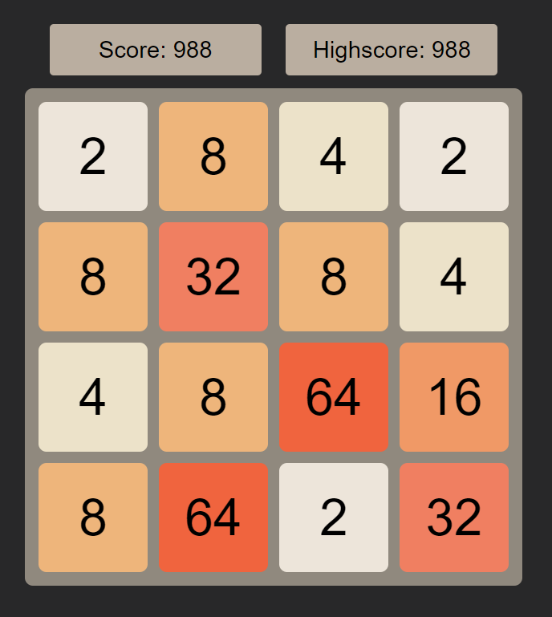

# 2048

## Table of Contents

-   [Description](#description)
-   [Dependencies](#dependencies)
-   [Presentation](#presentation)

## Description

This is a simple implementation of the game 2048 in Javascript. It is uses the [p5.js](https://p5js.org/) library for the graphics. The game is played in the browser. The game is not finished yet.

## Dependencies

-   [p5.js](https://p5js.org/)

## Presentation

